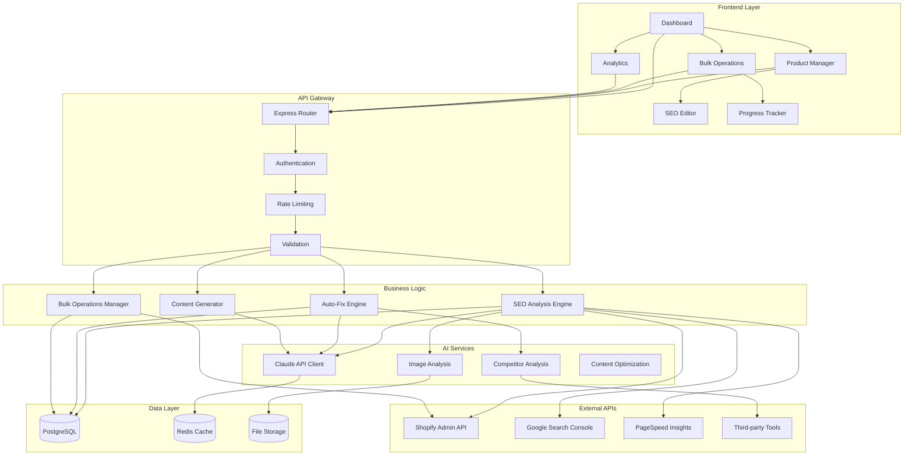
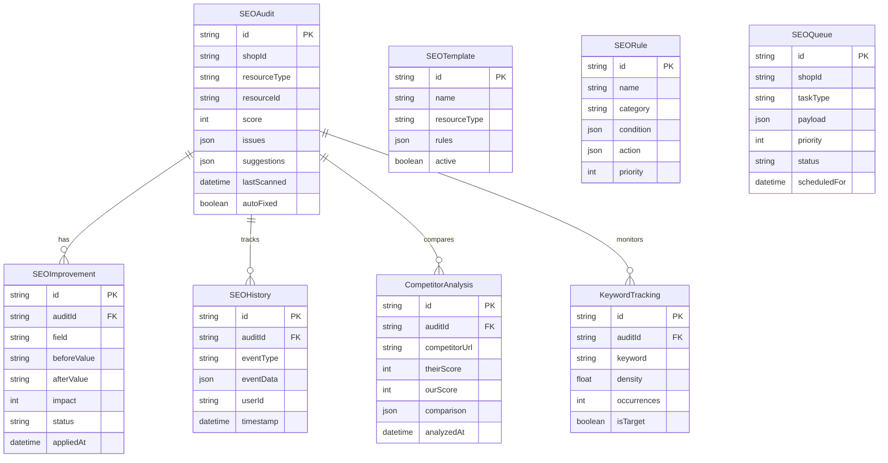
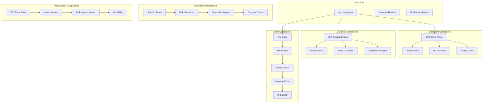
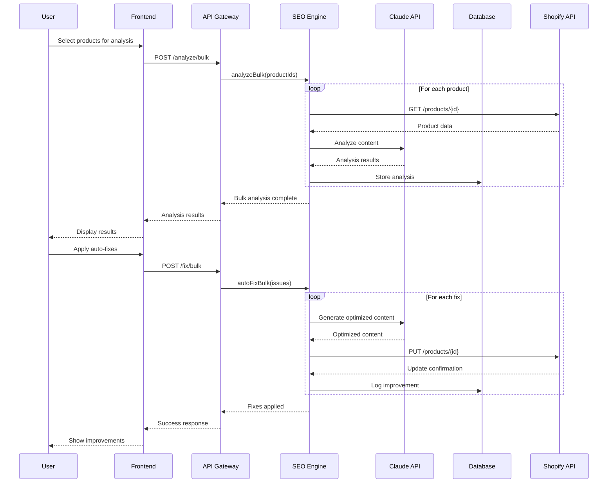
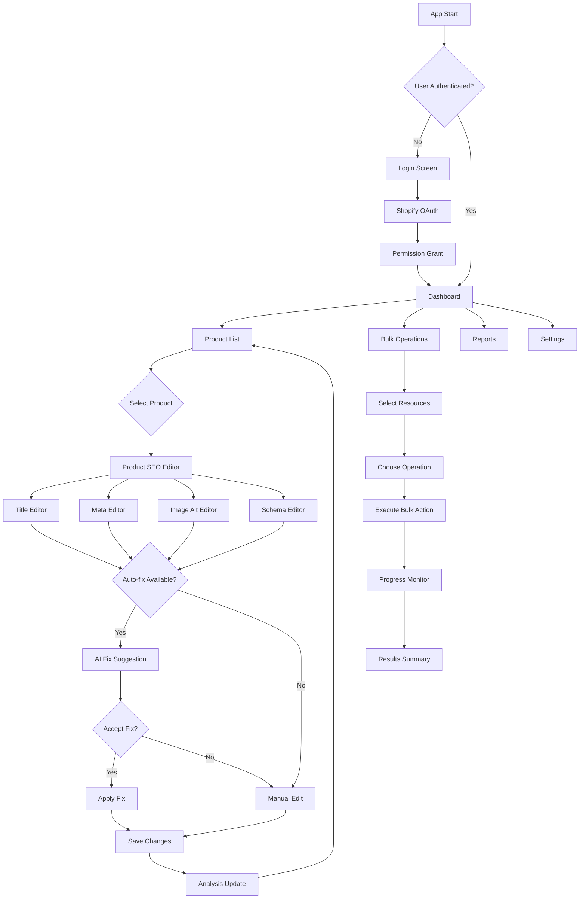
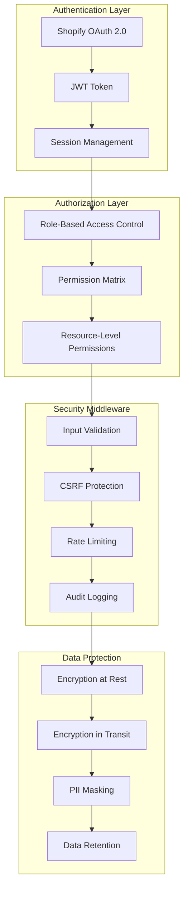
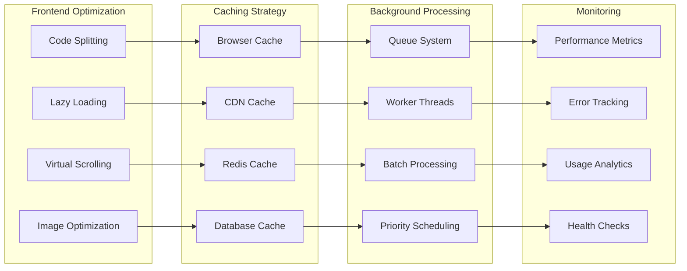
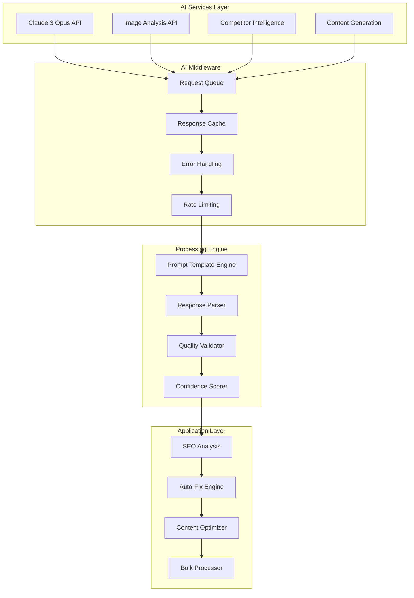
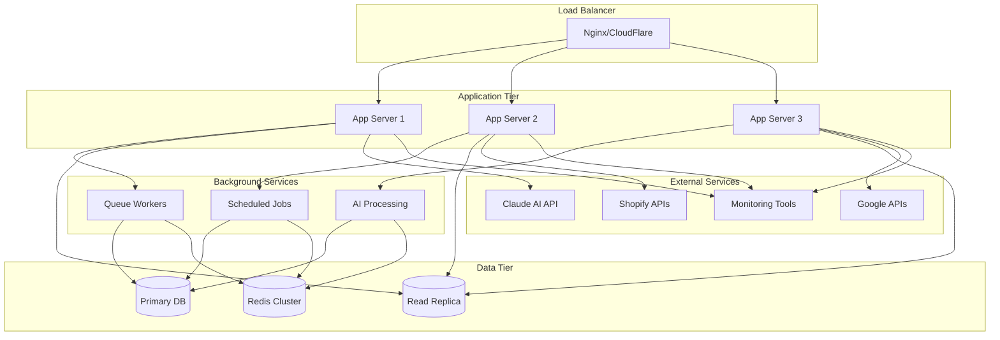

# SEO Automation Tool - Architecture Diagrams

## 1. Overall System Architecture

## 2. Database Schema Diagram

## 3. Component Architecture

## 4. Data Flow Diagram

## 5. User Interface Flow

## 6. Security & Permission Flow

## 7. Performance Architecture

## 8. AI Integration Architecture

## 9. Deployment Architecture

## How to Use These Diagrams

### In VS Code:
1. Install **Mermaid Preview** extension
2. Open any `.md` file with mermaid code
3. Use `Ctrl+Shift+P` → "Mermaid: Preview"

### In Draw.io:
1. Copy any mermaid code block
2. File → Import → Text
3. Paste the mermaid code
4. It will auto-convert to visual diagram

### Online Tools:
- **Mermaid Live Editor**: https://mermaid.live/
- **Draw.io**: https://app.diagrams.net/
- **GitLab/GitHub**: Native mermaid support

These diagrams provide **visual representation** of the entire architecture from your detailed specification!